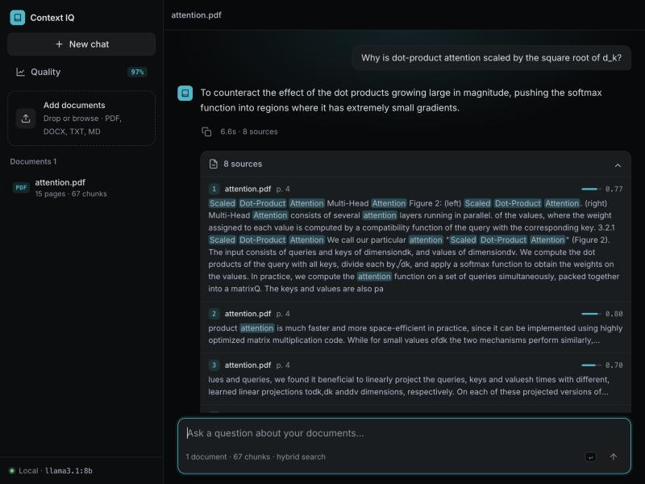
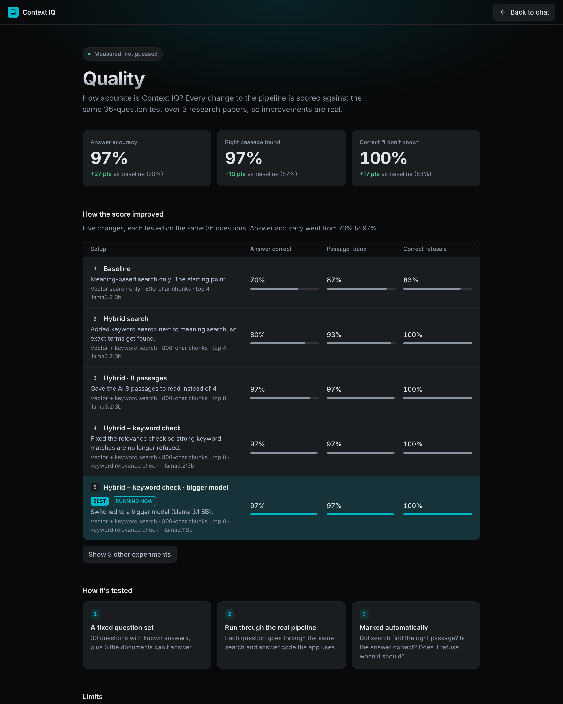
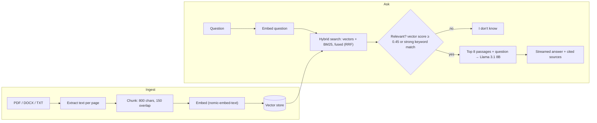

# Context IQ

**Chat with your documents. Every answer cites its sources, and the app says "I don't know" when the documents don't contain the answer.**

Context IQ is a retrieval-augmented generation (RAG) app that runs entirely on your own machine: no API keys, no data leaving your laptop. Upload PDFs, Word files, text or Markdown, then ask questions. It also ships with an **evaluation harness** that scores answer quality on a fixed test set, so every change to the pipeline is measured instead of guessed.


<p align="center">
  
</p>

## Why this project

Language models make things up when they don't know. RAG fixes that by retrieving the relevant passages first and telling the model to answer **only** from them. But a RAG app is only as good as its retrieval, and most demos never check. I wanted to build one and *prove* how well it works.

## Results

Scored on a fixed set of **36 questions** (30 answerable, 6 that the documents cannot answer) over three research papers (Attention Is All You Need, RAG, BERT; 287 chunks). Each row is one change to the pipeline, tested on the same questions.

| # | Change | Answer correct | Right passage found | Correct "I don't know" |
|---|---|---|---|---|
| 1 | Baseline: vector search only, top 4 passages | 70% | 87% | 83% |
| 2 | + keyword search (BM25) fused with vector search | 80% | 93% | 100% |
| 3 | + give the model 8 passages instead of 4 | 87% | 97% | 100% |
| 4 | + keyword-aware relevance check (see below) | **97%** | 97% | 100% |
| 5 | Llama 3.1 8B instead of Llama 3.2 3B | 97% | 97% | 100% |

<p align="center">
  
</p>

**Honest caveats:** it is a small test (one question moves a score by about 3 points), run once, and answers are marked by looking for key terms, which is a rough check. Treat the numbers as a reliable direction, not an exact score. The 3B and 8B models tie on this test, so the eval cannot tell them apart. Response-time numbers are not reported because Ollama's prompt caching made my timings unreliable.

### The most interesting finding

After adding hybrid search the score plateaued at 87%. Looking at the failures, the retrieval was fine, but the app was **refusing questions it could answer**. The "is this relevant enough?" gate used only the vector-similarity score, and rare terms (names, codes, product IDs) score low on meaning-based similarity even when the exact word is in the document. A strong keyword match now also counts as relevant. That one change took accuracy from 87% to 97% while keeping refusals at 100%, and it is covered by a unit test that reproduces the original failure.

## Features

- Upload **PDF, DOCX, TXT, Markdown**, several at once, with drag and drop
- **Hybrid retrieval**: vector search + BM25 keyword search, combined with reciprocal rank fusion
- **Cited answers** with the document, page and a similarity score, plus highlighted matching terms
- **Refuses** to answer when the documents don't contain it
- **Streaming** responses with a stop button
- Document management (remove, re-upload replaces instead of duplicating)
- **Quality page** that shows the eval results inside the app
- Fully local: [Ollama](https://ollama.com) runs both the embedding model and the language model

## Supported files

| Supported | Not supported (yet) |
|---|---|
| PDF (`.pdf`), Word (`.docx`, including tables), plain text (`.txt`), Markdown (`.md`) | Old Word (`.doc`), PowerPoint, Excel/CSV, images, and scanned PDFs without a text layer (these need OCR) |

Unsupported or empty files are rejected with a clear message. There is no upload size limit, and tables inside PDFs are read as plain text, so complex layouts may come out messy.

## How it works



## Quick start

Requires Python 3.10+ (developed and tested on 3.14) and [Ollama](https://ollama.com).

```bash
ollama pull nomic-embed-text
ollama pull llama3.1:8b

python3 -m venv .venv && source .venv/bin/activate
pip install -r requirements.txt
uvicorn app.main:app --port 8000
```

Then open `http://127.0.0.1:8000` in your browser (that address means "this computer", so it only works on your own machine while the app is running; there is no hosted demo), add a document, and ask a question. The 8B model needs roughly 6 GB of free memory; to use the lighter 3B model (same score on the eval) set `LLM_MODEL = "llama3.2:3b"` in [`app/config.py`](app/config.py).

## Run the tests and the eval

```bash
pip install -r requirements-dev.txt
pytest                                   # 13 fast tests, no Ollama needed
```

```bash
./scripts/fetch_eval_docs.sh             # downloads the 3 arXiv papers into docs/
python eval/run_eval.py llama8b-kwgate   # scores the current setup; try any label in eval/run_eval.py
```

Results are appended to `eval/results.jsonl` and appear on the in-app **Quality** page. To test your own idea, add a configuration to `CONFIGS` in [`eval/run_eval.py`](eval/run_eval.py) and run it by its label.

## Project structure

```
app/
  main.py        FastAPI routes: upload, ask (streaming), documents, eval results
  ingest.py      text extraction (PDF, DOCX, TXT) and chunking
  store.py       vector store with BM25 + vector search and rank fusion
  rag.py         retrieval, relevance gate, prompt, streaming answer
  llm.py         Ollama client (and an optional hosted-provider switch)
  index.html     chat UI        quality.html   eval results page
eval/
  questions.json 36 questions with expected key terms
  run_eval.py    runs configurations, scores them, logs results
tests/           unit and API tests (embeddings and LLM faked)
scripts/         fetch_eval_docs.sh
```

## Design decisions and trade-offs

- **Local-first.** Zero cost and no data leaves the machine. The trade-off is that nobody can try it without installing Ollama.
- **A simple JSON + NumPy vector store** instead of a vector database. With a few hundred chunks it is fast and has no moving parts. The store sits behind a small interface so Qdrant or pgvector could replace it.
- **Reciprocal rank fusion** to combine vector and keyword rankings, because their scores are on different scales and rank-based fusion needs no tuning.
- **Deterministic evaluation.** Temperature is 0, embeddings are cached, and the question set, marking rules and every result are in the repo.
- **Small, honest eval over a flashy one.** The marker is simple (key-term matching) and I say so, including how I fixed two cases where it marked correct answers wrong.

## Limitations and future work

- Each question is answered independently, so there is no chat memory for follow-ups
- Scanned PDFs without a text layer are rejected ("no text found"); OCR would fix this
- The eval is small and uses clean academic papers; messy real-world documents (tables, multi-column layouts) are untested
- One known retrieval miss in the eval: finding a passage that states a number in prose ("100 word passages")
- No authentication or upload size limit, so it is meant for local use
- A hosted live demo would need a hosted model and a CPU-friendly embedding model; the code has an optional provider switch, but the eval numbers above belong to the local Llama setup

## Tech stack

Python · FastAPI · NumPy · pypdf · python-docx · Ollama (Llama 3.1 8B, nomic-embed-text) · vanilla HTML/CSS/JS · pytest
